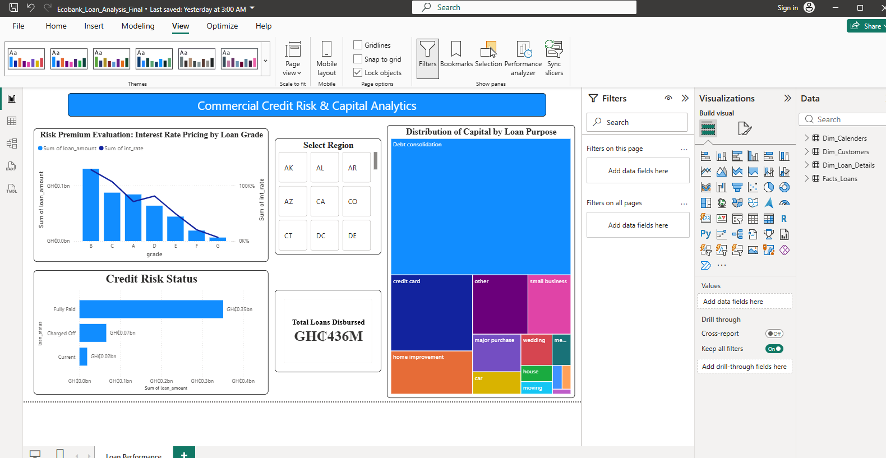

# Bank-loan-portfolio-analysis
An interactive Power BI Business Intelligence dashboard and data model designed to analyze loan portfolios, track non-performing loans (NPLs), and optimize credit risk assessment
## Key Features & Analytics
* **Dynamic KPI Tracking:** Real-time metrics for Total Loans, Active Balances, and Default/Non-Performing Loan (NPL) rates.
* **Risk Management Breakdown:** Interactive visual matrices and charts highlighting credit risk distribution across various business sectors.
* **Granular Filtering:** Built-in slicers for deep-dive temporal, regional, and loan-type analysis.

## Technical Architecture & Skills
* **Data Modeling:** Designed and implemented a clean **Star Schema** data model, establishing clear 1:N (one-to-many) relationships to optimize DAX query performance.
* **ETL Pipeline:** Utilized **Power Query** for comprehensive data cleaning, structural transformation, and business logic mapping.
* **Analytical Expressions:** Developed custom DAX measures for complex financial calculations and portfolio performance indicators.

## Dashboard Preview

